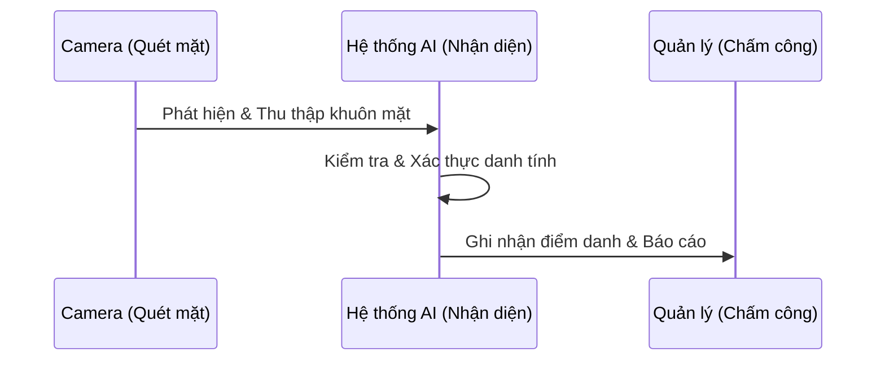
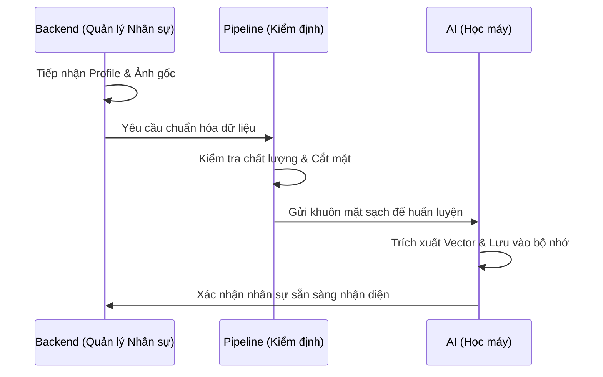
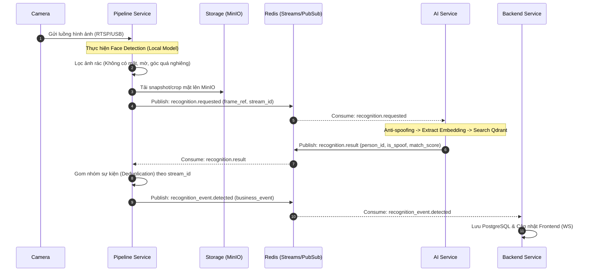
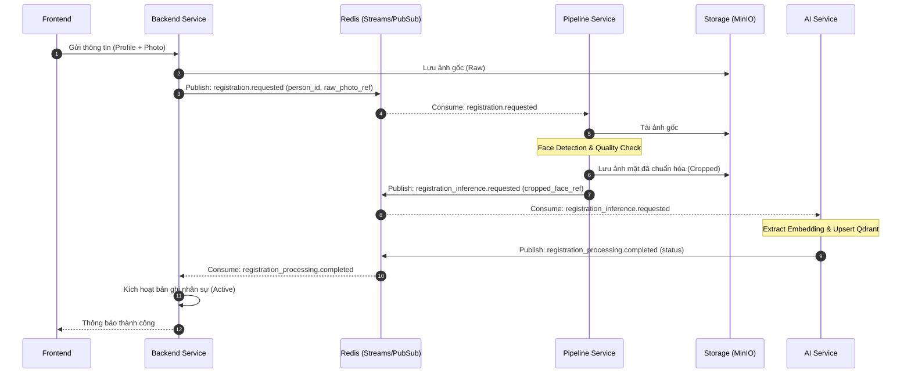

Tài liệu này mô tả các luồng nghiệp vụ chính của hệ thống Camera AI Attendance.

## 0. Tổng quan Nghiệp vụ (High-level Logic)

Dưới đây là cái nhìn rút gọn về logic xử lý của hệ thống, tập trung vào giá trị nghiệp vụ thay vì chi tiết kỹ thuật.

### Luồng Nhận diện (Realtime)

### Luồng Đăng ký (Registration)

---

## 1. Luồng Nhận diện từ Camera (Chi tiết Kỹ thuật)

### Logic xử lý thông minh tại Pipeline (Smart Filtering)

Để đảm bảo hiệu năng và độ chính xác, Pipeline không gửi mọi frame lên AI mà áp dụng các bộ lọc:

1. **Tiêu chí "Ảnh tốt nhất"**:
    - **Độ nét (Sharpness)**: Sử dụng thuật toán (như Laplacian) để bỏ qua các frame bị nhòe do chuyển động.
    - **Tư thế mặt (Pose)**: Ưu tiên các mặt nhìn thẳng (Yaw, Pitch, Roll trong khoảng cho phép). Bỏ qua các góc nhìn quá nghiêng.
    - **Kích thước (Size)**: Chỉ xử lý các khuôn mặt có kích thước đủ lớn (ví dụ > 80x80 pixel) để đảm bảo chất lượng embedding.

2. **Xử lý Đa khuôn mặt (Multi-face)**:
    - Trong 1 frame nếu có nhiều người, Pipeline sẽ detect toàn bộ, cắt từng khuôn mặt riêng biệt (crops) và gửi các yêu cầu nhận diện độc lập cho từng người.

3. **Cơ chế chống Spam (Tracking & Cooldown)**:
    - **Tracking**: Pipeline gán một `track_id` cho mỗi người trong khung hình.
    - **Chống lặp**: Một người đứng nói chuyện dưới camera sẽ không bị crop liên tục. Pipeline chỉ gửi nhận diện **1 lần** cho mỗi `track_id` (hoặc gửi lại sau một khoảng thời gian `cooldown` nếu người đó vẫn ở trong khung hình quá lâu).
    - **Chọn lọc & Best Effort**: 
        - Pipeline duy trì 2 ngưỡng: **Ngưỡng lý tưởng (Ideal)** và **Ngưỡng tối thiểu (Min)**.
        - Nếu có frame đạt ngưỡng Lý tưởng: Gửi ngay lập tức.
        - Nếu sau một khoảng thời gian (ví dụ 2 giây hoặc 30 frames) mà vẫn chưa có frame nào đạt ngưỡng Lý tưởng: Pipeline sẽ tự động lấy frame **tốt nhất trong số các frame đã thu thập** (đáp ứng ngưỡng Tối thiểu) để gửi đi.
        - Điều này đảm bảo dù có cố tình né tránh hoặc điều kiện ánh sáng xấu, hệ thống vẫn sẽ thực hiện nhận diện với dữ liệu tốt nhất có thể thay vì bỏ sót hoàn toàn.

## 2. Luồng Đăng ký Nhân viên mới (New Employee Registration)

## 3. Thống nhất Contract chính (Qua Redis)

| Topic / Stream | Producer | Consumer | Dữ liệu chính |
| :--- | :--- | :--- | :--- |
| `recognition.requested` | Pipeline | AI Service | `frame_ref`, `stream_id`, `detected_box` |
| `recognition.result` | AI Service | Pipeline | `person_id`, `is_spoof`, `match_score` |
| `recognition_event.detected` | Pipeline | Backend | `person_id`, `stream_id`, `snapshot_ref` |
| `registration.requested` | Backend | Pipeline | `person_id`, `raw_photo_ref` |
| `registration_inference.requested` | Pipeline | AI Service | `person_id`, `cropped_face_ref` |
| `registration_processing.completed`| AI Service | Backend | `person_id`, `status`, `indexing_result` |
