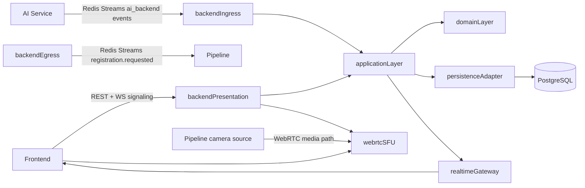

# Kế hoạch tổng thể backend (Clean Architecture)

## Mục tiêu và ràng buộc
- Backend là trung tâm orchestration cho frontend, persistence và event integration.
- Realtime video chọn `WebRTC`.
- Event liên service chọn `Redis Streams` theo contracts trong `packages/contracts`.
- Tuân thủ clean architecture: `domain` -> `application` -> `infrastructure`/`presentation`.

## Hiện trạng codebase cần tận dụng
- Skeleton backend đã tách lớp đúng hướng tại [D:/Face Recognition/apps/backend/app](D:/Face Recognition/apps/backend/app):
  - `domain/`, `application/`, `infrastructure/`, `presentation/`, `bootstrap/`.
- DB schema đã có migration tại [D:/Face Recognition/apps/backend/migrations/versions/20260419_0001_phase1_initial_schema.py](D:/Face Recognition/apps/backend/migrations/versions/20260419_0001_phase1_initial_schema.py).
- Contracts event đã chốt tại [D:/Face Recognition/packages/contracts](D:/Face Recognition/packages/contracts):
  - `ai_backend/*`, `backend_pipeline/*`, `common/envelope.schema.json`, `common/media_asset_ref.schema.json`.

## Kiến trúc mục tiêu

## Phase 1 - Foundation (khởi tạo clean architecture chạy được)
- Hoàn thiện composition root tại [D:/Face Recognition/apps/backend/app/bootstrap/container.py](D:/Face Recognition/apps/backend/app/bootstrap/container.py): wiring interfaces -> concrete adapters.
- Hoàn thiện app bootstrap tại [D:/Face Recognition/apps/backend/app/main.py](D:/Face Recognition/apps/backend/app/main.py): lifecycle, router mount, Redis consumer startup, graceful shutdown.
- Chuẩn hóa config tại [D:/Face Recognition/apps/backend/app/core/config.py](D:/Face Recognition/apps/backend/app/core/config.py): `REDIS_URL`, stream names, consumer group, WebRTC signaling config.
- Tạo error model + result pattern thống nhất ở `application` và map sang HTTP status tại `presentation`.

## Phase 2 - API cho frontend (Task 1)
- Implement read APIs trong [D:/Face Recognition/apps/backend/app/presentation/api/v1](D:/Face Recognition/apps/backend/app/presentation/api/v1):
  - persons, attendance, unknown events, spoof alerts, media.
- Define request/response DTO rõ ràng tại [D:/Face Recognition/apps/backend/app/presentation/schemas](D:/Face Recognition/apps/backend/app/presentation/schemas), tách biệt với event contracts.
- Implement use-cases query trong [D:/Face Recognition/apps/backend/app/application/use_cases](D:/Face Recognition/apps/backend/app/application/use_cases).
- Implement repository adapters + ORM models ở [D:/Face Recognition/apps/backend/app/infrastructure/persistence](D:/Face Recognition/apps/backend/app/infrastructure/persistence).

## Phase 3 - Realtime video WebRTC (Task 2)
- Backend chỉ giữ vai trò signaling/session orchestration (không transcode media trong backend app logic).
- Thêm signaling endpoints (REST/WS) tại `presentation/api/v1`:
  - tạo/join room stream, exchange SDP offer/answer, ICE candidates.
- Tạo `RealtimeSessionGateway` abstraction ở `application/interfaces`; implement adapter ở `infrastructure/integration` để kết nối SFU (khuyến nghị mediasoup/Janus/LiveKit).
- Chuẩn hóa auth mapping user-camera-room ở backend để frontend subscribe stream đúng quyền.
- Tạo fallback chiến lược: nếu WebRTC lỗi -> frontend poll event APIs để vẫn có UX tối thiểu.

## Phase 4 - Nhận AI events, xử lý và push frontend (Task 3)
- Implement Redis Streams inbound consumer adapter tại `infrastructure/integration`:
  - đọc các event `frame_analysis.updated`, `recognition_event.detected`, `unknown_event.detected`, `spoof_alert.detected`, `registration_processing.completed`.
- Validate envelope + payload theo schema contracts trước khi vào use-case.
- Tách use-case xử lý:
  - realtime overlay event -> publish qua websocket channel cho frontend,
  - business events -> persist DB + optional notify frontend.
- Thiết kế idempotency:
  - dùng `message_id` + `dedupe_key` + unique constraints DB để tránh ghi trùng.

## Phase 5 - Gửi event xuống pipeline (Task 4)
- Implement outbound publisher adapter tại [D:/Face Recognition/apps/backend/app/infrastructure/integration/pipeline_client.py](D:/Face Recognition/apps/backend/app/infrastructure/integration/pipeline_client.py) theo Redis Streams.
- Tạo use-case publish `registration.requested` (từ backend action).
- Bổ sung outbox pattern tối thiểu (table outbox + background dispatcher) để đảm bảo at-least-once khi lỗi Redis.
- Thêm retry/backoff + dead-letter strategy cho event publish thất bại.

## Phase 6 - Hardening, observability, test strategy
- Logging correlation: propagate `correlation_id`, `causation_id` xuyên suốt request/event.
- Metrics/health:
  - Redis lag, consumer group pending, WS/WebRTC session count.
- Test plan:
  - unit test cho use-cases,
  - contract test validate schema payload,
  - integration test Redis + Postgres,
  - e2e smoke cho flow: AI event -> DB -> frontend update.
- Document architecture/runbook tại [D:/Face Recognition/docs/architecture/README.md](D:/Face Recognition/docs/architecture/README.md) và API docs tại [D:/Face Recognition/docs/api/README.md](D:/Face Recognition/docs/api/README.md).

## Chuỗi triển khai ưu tiên (để có giá trị sớm)
1. Foundation + read APIs cơ bản cho frontend.
2. Redis consumer cho business events (persist trước, push realtime sau).
3. WebSocket push event frontend.
4. Outbound publish xuống pipeline (`registration.requested`).
5. WebRTC signaling + tích hợp SFU hoàn chỉnh.
6. Hardening (outbox, metrics, DLQ, full test suite).
