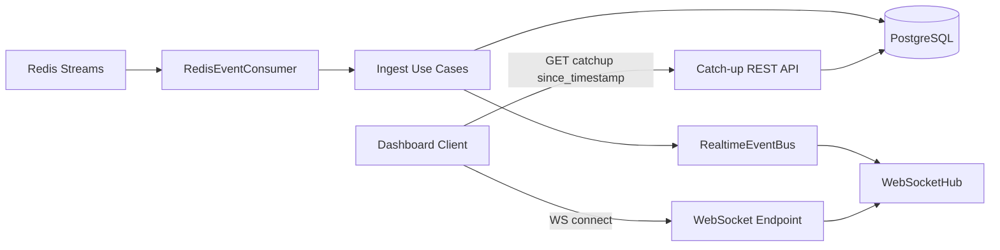

# Backend Realtime (WebSocket + Event Bus + Catch-up)

## Mục tiêu
- Đẩy dữ liệu realtime từ backend sang dashboard qua WebSocket.
- Cho phép client reconnect và lấy lại các event bị lỡ bằng cơ chế catch-up theo `since_timestamp`.
- Giữ tách lớp theo clean architecture: `application` -> `infrastructure` -> `presentation`.

## Bức tranh tổng quan


---

## Các thành phần chính và ý nghĩa

### 1) Realtime DTO + Channel contract
- File: `apps/backend/app/application/dtos/realtime.py`
- Vai trò:
  - Định nghĩa các kênh realtime:
    - `events.business`
    - `stream.overlay`
    - `stream.health`
  - Định nghĩa format message chuẩn `RealtimeEnvelope`.

`RealtimeEnvelope` gồm:
- `channel`: kênh nhận.
- `event_type`: loại event cụ thể.
- `occurred_at`: thời điểm event xảy ra.
- `correlation_id`: id truy vết liên luồng.
- `dedupe_key`: khóa chống trùng ở business level.
- `payload`: dữ liệu nghiệp vụ.
- `metadata`: metadata kỹ thuật (ví dụ `message_id`, `producer`).

### 2) Realtime Event Bus (abstraction + implementation)
- Interface: `apps/backend/app/application/interfaces/realtime_event_bus.py`
- Implementation: `apps/backend/app/infrastructure/realtime/event_bus.py`
- Vai trò:
  - Là lớp trung chuyển giữa use-case và websocket hub.
  - Use-case chỉ gọi `publish(envelope)` qua interface, không phụ thuộc chi tiết websocket.

### 3) WebSocket Hub
- File: `apps/backend/app/infrastructure/realtime/websocket_hub.py`
- Vai trò:
  - Quản lý danh sách client WS đang kết nối.
  - Quản lý subscribe/unsubscribe theo channel.
  - Fan-out message tới đúng client.
  - Có queue per-connection để chống nghẽn.
  - Có heartbeat và metrics runtime.

Metrics hiện có:
- `active_connections`
- `sent_messages`
- `dropped_messages`
- `disconnect_slow_client`

### 4) JWT bảo vệ kết nối WS
- File: `apps/backend/app/core/security.py`
- Vai trò:
  - Parse bearer token (header/query).
  - Verify JWT HS256 signature.
  - Validate các claim quan trọng: `iss`, `aud`, `exp`, `sub`.
  - Trả về `AuthenticatedPrincipal`.

### 5) WebSocket endpoint + Catch-up endpoint
- File: `apps/backend/app/presentation/api/v1/realtime_ws.py`
- Endpoint:
  - WS realtime: `ws /api/ws/v1/realtime`
  - REST catch-up: `GET /api/ws/v1/realtime/catchup`

---

## Input/Output chi tiết

## A. WebSocket realtime
### Input khi connect
- URL: `/api/ws/v1/realtime`
- Auth:
  - Header `Authorization: Bearer <token>` hoặc query `token=<jwt>`
- Query tùy chọn:
  - `channels=events.business,stream.overlay,...`
  - Nếu không truyền -> mặc định `events.business`.

### Input control message trong WS session
- Subscribe:
```json
{"action":"subscribe","channel":"stream.overlay"}
```
- Unsubscribe:
```json
{"action":"unsubscribe","channel":"stream.overlay"}
```

### Output từ server qua WS
- Format:
```json
{
  "channel": "events.business",
  "event_type": "recognition_event.detected",
  "occurred_at": "2026-04-24T01:02:03+00:00",
  "correlation_id": "uuid-or-null",
  "dedupe_key": "optional-key",
  "payload": {...},
  "metadata": {...}
}
```
- Heartbeat:
```json
{"event_type":"heartbeat"}
```

## B. Catch-up REST API
### Request
- `GET /api/ws/v1/realtime/catchup`
- Query params:
  - `channel` (mặc định `events.business`)
  - `since_timestamp` (bắt buộc, ISO datetime)
  - `limit` (mặc định 200, max 1000)

### Response
- Schema: `RealtimeCatchupResponse`
- Ví dụ:
```json
{
  "channel": "events.business",
  "since_timestamp": "2026-04-24T00:59:00+00:00",
  "items": [
    {
      "event_type": "spoof_alert.detected",
      "occurred_at": "2026-04-24T01:00:00+00:00",
      "correlation_id": null,
      "dedupe_key": "sk-1",
      "payload": {"id":"spoof-1"},
      "metadata": {"source":"catchup"}
    }
  ]
}
```

Lưu ý hiện tại:
- `events.business`: có dữ liệu catch-up từ DB.
- `stream.overlay`, `stream.health`: đang trả rỗng vì chưa persist lịch sử trong DB.

---

## Luồng dữ liệu chính

### 1) Luồng live realtime
1. `RedisEventConsumer` nhận event từ Redis stream.
2. Ingest use-case xử lý + ghi DB (nếu là business event).
3. Sau khi processed, backend tạo `RealtimeEnvelope`.
4. Gọi `realtime_event_bus.publish(...)`.
5. `WebSocketHub` phát message cho client subscribe đúng channel.

### 2) Luồng reconnect + catch-up
1. Client reconnect WS.
2. Client gọi `GET /api/ws/v1/realtime/catchup?since_timestamp=...`.
3. Backend query recognition/unknown/spoof theo timestamp và merge-sort tăng dần thời gian.
4. Client merge replay theo `dedupe_key`.
5. Client tiếp tục nhận live qua WS.

---

## Mapping event sources -> channel
- `recognition_event.detected` -> `events.business`
- `unknown_event.detected` -> `events.business`
- `spoof_alert.detected` -> `events.business`
- `frame_analysis.updated` -> `stream.overlay`
- `stream.health.updated` -> `stream.health`

---

## Cấu hình liên quan
- File: `apps/backend/app/core/config.py`
- Nhóm chính:
  - JWT: `JWT_ALGORITHM`, `JWT_SECRET_KEY`, `JWT_ISSUER`, `JWT_AUDIENCE`
  - WS: `WS_ENABLE`, `WS_MAX_CONNECTIONS`, `WS_QUEUE_SIZE`, `WS_HEARTBEAT_SECONDS`
  - Redis streams: `REDIS_STREAM_AI_EVENTS`, `REDIS_STREAM_PIPELINE_EVENTS`, ...

---

## Test coverage hiện có (realtime/reconnect)
- `apps/backend/tests/unit/test_security_jwt.py`
  - verify JWT success/fail.
- `apps/backend/tests/integration/test_realtime_websocket.py`
  - WS auth và fan-out cơ bản.
- `apps/backend/tests/unit/test_realtime_catchup_use_case.py`
  - catch-up sort order + channel behavior.
- `apps/backend/tests/integration/test_realtime_catchup_api.py`
  - endpoint catch-up response shape.

---

## Hạn chế hiện tại
- Catch-up cho `stream.overlay` và `stream.health` chưa có persistence replay.
- Chưa có session resume theo cursor/message_id (đang dùng `since_timestamp`).
- Logic reconnect tự động/backoff nằm phía frontend client (backend đã hỗ trợ endpoint + flow).

---

## Frontend Integration Guide

Phần này là checklist để team frontend dùng realtime service của backend một cách ổn định.

### 1) Chuẩn bị dữ liệu ở frontend
- Lưu `lastReceivedTimestamp` (ISO UTC string) mỗi khi nhận được message hợp lệ từ WS.
- Dùng `dedupe_key` để chống hiển thị trùng khi merge dữ liệu từ catch-up và live.
- Tạo local store theo `event_type` hoặc theo `channel` tùy UI.

### 2) Trình tự kết nối khuyến nghị
1. Lấy JWT hợp lệ.
2. Mở WS tới `/api/ws/v1/realtime?channels=events.business,stream.overlay`.
3. Khi WS mở lại sau disconnect, gọi catch-up:
   - `GET /api/ws/v1/realtime/catchup?channel=events.business&since_timestamp=<lastReceivedTimestamp>&limit=200`
4. Merge replay theo `dedupe_key`.
5. Tiếp tục consume stream live từ WS.

### 3) Mẫu code frontend (JavaScript/TypeScript)
```ts
type RealtimeMessage = {
  channel?: string;
  event_type: string;
  occurred_at?: string;
  correlation_id?: string | null;
  dedupe_key?: string | null;
  payload?: Record<string, unknown>;
  metadata?: Record<string, unknown>;
};

const API_BASE = "http://localhost:8000";
const WS_BASE = "ws://localhost:8000";

let socket: WebSocket | null = null;
let reconnectTimer: number | null = null;
let retryCount = 0;
let lastReceivedTimestamp: string = new Date(0).toISOString();
const seenKeys = new Set<string>();

function rememberMessage(msg: RealtimeMessage) {
  if (msg.occurred_at) {
    if (msg.occurred_at > lastReceivedTimestamp) lastReceivedTimestamp = msg.occurred_at;
  }
  if (msg.dedupe_key) seenKeys.add(msg.dedupe_key);
}

function applyBusinessMessage(msg: RealtimeMessage) {
  if (msg.dedupe_key && seenKeys.has(msg.dedupe_key)) return;
  // TODO: update UI state/store
  rememberMessage(msg);
}

async function fetchCatchup(jwt: string) {
  const url = new URL(`${API_BASE}/api/ws/v1/realtime/catchup`);
  url.searchParams.set("channel", "events.business");
  url.searchParams.set("since_timestamp", lastReceivedTimestamp);
  url.searchParams.set("limit", "200");
  const res = await fetch(url, {
    headers: { Authorization: `Bearer ${jwt}` },
  });
  if (!res.ok) throw new Error(`Catch-up failed: ${res.status}`);
  const data = await res.json();
  for (const item of data.items ?? []) {
    applyBusinessMessage(item);
  }
}

function connectRealtime(jwt: string) {
  const wsUrl = `${WS_BASE}/api/ws/v1/realtime?token=${encodeURIComponent(jwt)}&channels=events.business,stream.overlay,stream.health`;
  socket = new WebSocket(wsUrl);

  socket.onopen = async () => {
    retryCount = 0;
    try {
      await fetchCatchup(jwt);
    } catch (err) {
      console.error(err);
    }
  };

  socket.onmessage = (event) => {
    const msg: RealtimeMessage = JSON.parse(event.data);
    if (msg.event_type === "heartbeat") return;
    if (msg.channel === "events.business") {
      applyBusinessMessage(msg);
      return;
    }
    // TODO: overlay/health rendering if needed
  };

  socket.onclose = () => scheduleReconnect(jwt);
  socket.onerror = () => socket?.close();
}

function scheduleReconnect(jwt: string) {
  if (reconnectTimer) window.clearTimeout(reconnectTimer);
  const delayMs = Math.min(30000, 1000 * 2 ** Math.min(retryCount, 5)); // exponential backoff
  retryCount += 1;
  reconnectTimer = window.setTimeout(() => connectRealtime(jwt), delayMs);
}
```

### 4) Quy tắc xử lý dữ liệu ở frontend
- Nếu `event_type = heartbeat`: bỏ qua ở business UI.
- Nếu có `dedupe_key` đã thấy trước đó: bỏ qua event đó.
- Khi nhận event mới:
  - update UI state,
  - cập nhật `lastReceivedTimestamp`,
  - lưu `dedupe_key` vào cache in-memory.

### 5) Xử lý lỗi thường gặp
- `1008 policy violation` khi WS connect:
  - JWT sai hoặc hết hạn.
  - Kiểm tra `iss`, `aud`, `exp`.
- Catch-up trả lỗi `422`:
  - `since_timestamp` sai định dạng ISO datetime.
- Mất event sau reconnect:
  - Đảm bảo luôn gọi catch-up trước khi coi stream live là ổn định.
  - Đảm bảo frontend cập nhật `lastReceivedTimestamp` sau mỗi event.

### 6) Khuyến nghị cho dashboard 1 client
- Dùng `channels=events.business` nếu không cần overlay/health để giảm tải.
- `limit=200` thường đủ cho reconnect ngắn.
- Có thể reset `seenKeys` theo vòng đời trang (không cần persist lâu dài trong localStorage nếu quy mô nhỏ).

